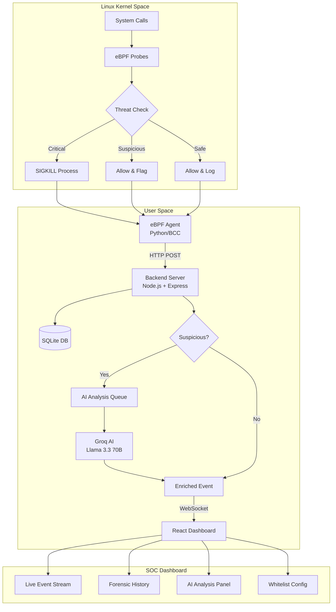

# Kernel-Watch: eBPF-Based Real-Time Security Monitoring System

## System Architecture Documentation v3.0

---

## Table of Contents
1. [Executive Summary](#executive-summary)
2. [System Overview](#system-overview)
3. [Architecture Diagram](#architecture-diagram)
4. [File Structure](#file-structure)
5. [Component Details](#component-details)
6. [Database Schema](#database-schema)
7. [API Reference](#api-reference)
8. [Key Code Snippets](#key-code-snippets)
9. [Security Features](#security-features)
10. [AI Integration](#ai-integration)

---

## Executive Summary

Kernel-Watch is a real-time Linux security monitoring system that leverages eBPF (Extended Berkeley Packet Filter) technology to intercept and analyze system calls at the kernel level. The system provides:

- **Real-time threat detection** at the kernel level with sub-millisecond response
- **Automatic blocking** of malicious executables via SIGKILL
- **AI-powered analysis** using Groq's Llama 3.3 70B model
- **SQLite persistence** for forensic history and audit trails
- **Dynamic configuration** - whitelist management without restarts
- **Professional SOC dashboard** with real-time WebSocket updates

---

## System Overview

```
┌─────────────────────────────────────────────────────────────────────────────┐
│                        KERNEL-WATCH SECURITY SUITE v3.0                     │
├─────────────────────────────────────────────────────────────────────────────┤
│                                                                             │
│   ┌─────────────┐     ┌─────────────────┐     ┌───────────────────────┐    │
│   │   KERNEL    │     │    BACKEND      │     │      FRONTEND         │    │
│   │   (eBPF)    │────▶│   (Node.js)     │────▶│     (React/Vite)      │    │
│   │             │     │                 │     │                       │    │
│   │  Sentinel   │     │   The Brain     │     │    SOC Dashboard      │    │
│   │   Agent     │     │   + SQLite DB   │     │                       │    │
│   └─────────────┘     └────────┬────────┘     └───────────────────────┘    │
│                                │                                            │
│                       ┌────────▼────────┐                                   │
│                       │    GROQ AI      │                                   │
│                       │  Llama 3.3 70B  │                                   │
│                       └─────────────────┘                                   │
│                                                                             │
└─────────────────────────────────────────────────────────────────────────────┘
```

---

## Architecture Diagram

### High-Level System Flow



---

## File Structure

```
kernel-watch/
├── backend/
│   ├── server.js              # Main backend server with SQLite
│   ├── package.json           # Node.js dependencies
│   ├── kernel-watch.sqlite    # SQLite database (auto-created)
│   └── .env                   # API keys (GROQ_API_KEY)
│
├── frontend/
│   ├── src/
│   │   ├── Dashboard.jsx      # Main SOC dashboard component
│   │   ├── History.jsx        # Forensic history with pagination
│   │   ├── WhitelistConfig.jsx # Dynamic whitelist management
│   │   ├── WorldMap.jsx       # GeoIP visualization
│   │   ├── index.css          # Cyberpunk theme styles
│   │   ├── main.jsx           # React entry point
│   │   └── App.jsx            # App wrapper
│   ├── index.html             # HTML template
│   └── vite.config.js         # Vite configuration
│
├── monitor.c                  # eBPF C program (kernel probes)
├── watcher.py                 # Python eBPF agent
├── test_memfd.py              # Fileless malware test
├── test_lineage.py            # Reverse shell detection test
├── start_all.sh               # Launch script for all components
└── SYSTEM_ARCHITECTURE.md     # This documentation
```

---

## Component Details

### 1. eBPF Sentinel Agent

**Files:** `monitor.c`, `watcher.py`

**Technology:** C (eBPF), Python, BCC (BPF Compiler Collection)

**Function:** Kernel-level syscall interception with real-time threat blocking

**Monitored Syscalls:**
| Syscall | Event Type | Purpose |
|---------|-----------|---------|
| `execve` | EXEC | Process execution monitoring |
| `tcp_v4_connect` | NET | Outbound network connections |
| `memfd_create` | MEMFD | Fileless malware detection |

**Threat Levels:**
| Level | Name | Action |
|-------|------|--------|
| 0 | SAFE | Allow, log to backend |
| 1 | SUSPICIOUS | Allow, flag for AI analysis |
| 2 | CRITICAL | SIGKILL immediately, log |

---

### 2. Backend Server

**File:** `backend/server.js`

**Technology:** Node.js, Express, Socket.IO, better-sqlite3, Groq SDK

**Key Features:**
- SQLite persistence for forensic history
- Dynamic whitelist management
- AI analysis queue with rate limiting
- Real-time WebSocket broadcasting
- GeoIP enrichment for network events
- RESTful API with pagination

---

### 3. Frontend Dashboard

**Files:** `frontend/src/Dashboard.jsx`, `History.jsx`, `WhitelistConfig.jsx`

**Technology:** React, Vite, Socket.IO Client, Framer Motion

**Features:**
- Real-time event streaming via WebSocket
- 6 metric cards (Total, Exec, Net, Safe, Threats, Blocked)
- Event filtering (search, type, threats-only)
- Click-to-drill-down modal with AI analysis
- Forensic history with pagination
- Dynamic whitelist management UI
- Sound alerts for critical threats
- GeoIP world map visualization
- Export to JSON/CSV

---

## Database Schema

### SQLite Tables

```sql
-- Events table for forensic history
CREATE TABLE events (
    id INTEGER PRIMARY KEY AUTOINCREMENT,
    timestamp TEXT NOT NULL,
    type TEXT NOT NULL,           -- EXEC, NET, MEMFD
    severity TEXT NOT NULL,       -- safe, suspicious, critical
    process_name TEXT,
    pid INTEGER,
    details TEXT,                 -- JSON blob with full event data
    ai_analysis TEXT              -- JSON blob with AI response
);

-- Dynamic whitelist table
CREATE TABLE whitelist (
    id INTEGER PRIMARY KEY AUTOINCREMENT,
    process_name TEXT UNIQUE NOT NULL,
    added_at TEXT NOT NULL,
    reason TEXT
);

-- Indexes for query performance
CREATE INDEX idx_events_timestamp ON events(timestamp);
CREATE INDEX idx_events_severity ON events(severity);
CREATE INDEX idx_events_type ON events(type);
```

---

## API Reference

### REST Endpoints

| Method | Endpoint | Description |
|--------|----------|-------------|
| POST | `/api/ingest` | Receive events from eBPF agent |
| GET | `/api/history` | Paginated event history (?page, ?limit, ?severity, ?type) |
| GET | `/api/stats` | Current statistics |
| GET | `/api/threats` | Recent threat log (last 100) |
| GET | `/api/whitelist` | List all whitelist entries |
| POST | `/api/actions/whitelist` | Add process to whitelist |
| DELETE | `/api/whitelist/:id` | Remove from whitelist |
| GET | `/api/export/threats` | Export threats as JSON |
| GET | `/api/export/history` | Export history as CSV |

### WebSocket Events

| Event | Direction | Description |
|-------|-----------|-------------|
| `security_event` | Server → Client | Real-time event broadcast |
| `stats` | Server → Client | Statistics update |
| `threat_log` | Server → Client | Initial threat buffer on connect |
| `ai_history` | Server → Client | AI analysis history on connect |
| `geo_connection` | Server → Client | GeoIP connection for map |
| `whitelist_updated` | Server → Client | Whitelist change notification |

---

## Key Code Snippets

### 1. eBPF Process Execution Hook (monitor.c)

```c
// Process execution hook with lineage check and path-based detection
int syscall__execve(struct pt_regs *ctx,
    const char __user *filename,
    const char __user *const __user *argv,
    const char __user *const __user *envp)
{
    struct data_t data = {};
    data.type = EVENT_EXEC;
    data.pid = bpf_get_current_pid_tgid() >> 32;
    data.ppid = get_ppid();
    bpf_get_current_comm(&data.comm, sizeof(data.comm));
    get_parent_comm(data.parent_comm);
    bpf_probe_read_user_str(&data.fname, sizeof(data.fname), filename);
    data.threat_level = THREAT_SAFE;

    // MASTER LEVEL: Process Lineage Check (Reverse Shell Detection)
    // If a network service spawns a shell -> CRITICAL
    if (is_shell_path(data.fname) && is_network_service(data.comm)) {
        data.threat_level = THREAT_CRITICAL;
        bpf_send_signal(9);  // SIGKILL - Stop reverse shell immediately!
    }
    // /tmp/ execution -> CRITICAL (common malware staging area)
    else if (data.fname[0] == '/' && data.fname[1] == 't' && 
             data.fname[2] == 'm' && data.fname[3] == 'p' && 
             data.fname[4] == '/') {
        data.threat_level = THREAT_CRITICAL;
        bpf_send_signal(9);
    }
    // /dev/shm/ execution -> CRITICAL (RAM-based, no disk trace)
    else if (data.fname[0] == '/' && data.fname[1] == 'd' && 
             data.fname[2] == 'e' && data.fname[3] == 'v' && 
             data.fname[4] == '/' && data.fname[5] == 's' &&
             data.fname[6] == 'h' && data.fname[7] == 'm') {
        data.threat_level = THREAT_CRITICAL;
        bpf_send_signal(9);
    }
    // /var/tmp/ execution -> SUSPICIOUS
    else if (data.fname[0] == '/' && data.fname[1] == 'v' && 
             data.fname[2] == 'a' && data.fname[3] == 'r' &&
             data.fname[4] == '/' && data.fname[5] == 't') {
        data.threat_level = THREAT_SUSPICIOUS;
    }

    events.perf_submit(ctx, &data, sizeof(data));
    return 0;
}
```

### 2. Fileless Malware Detection (monitor.c)

```c
// Detect memfd_create syscall - used for fileless malware
TRACEPOINT_PROBE(syscalls, sys_enter_memfd_create)
{
    struct data_t data = {};
    data.type = EVENT_MEMFD;
    data.pid = bpf_get_current_pid_tgid() >> 32;
    data.ppid = get_ppid();
    bpf_get_current_comm(&data.comm, sizeof(data.comm));
    get_parent_comm(data.parent_comm);
    bpf_probe_read_user_str(&data.fname, sizeof(data.fname), (void *)args->uname);
    
    // SUSPICIOUS by default - memfd_create is rarely used legitimately
    data.threat_level = THREAT_SUSPICIOUS;
    
    // CRITICAL if spawned from network service (likely dropper payload)
    if (is_network_service(data.parent_comm)) {
        data.threat_level = THREAT_CRITICAL;
        bpf_send_signal(9);  // Kill fileless malware attempt
    }
    
    events.perf_submit(args, &data, sizeof(data));
    return 0;
}
```

### 3. Dynamic Whitelist Check (server.js)

```javascript
// Load dynamic whitelist from SQLite into memory for fast lookups
let dynamicWhitelist = new Set(
    db.prepare('SELECT process_name FROM whitelist').all()
       .map(row => row.process_name)
);

function isWhitelisted(event) {
    // Check static whitelist (hardcoded common system processes)
    if (event.comm && STATIC_WHITELISTED_PROCESSES.includes(event.comm)) 
        return true;

    // Check DYNAMIC whitelist from database
    if (event.comm && dynamicWhitelist.has(event.comm)) {
        return true;
    }

    // Check path-based whitelist
    if (event.fname && dynamicWhitelist.has(event.fname)) 
        return true;
    
    return false;
}
```

### 4. SQLite Event Persistence (server.js)

```javascript
// Database initialization with WAL mode for performance
const db = new Database(path.join(__dirname, 'kernel-watch.sqlite'));
db.pragma('journal_mode = WAL');

// Prepared statement for event insertion
const insertEventStmt = db.prepare(`
    INSERT INTO events (timestamp, type, severity, process_name, pid, details, ai_analysis)
    VALUES (?, ?, ?, ?, ?, ?, ?)
`);

// Save event to database
function saveEventToDB(event, severity, aiAnalysis) {
    insertEventStmt.run(
        new Date().toISOString(),
        event.type || 'EXEC',
        severity,
        event.comm || null,
        event.pid || null,
        JSON.stringify(event),
        aiAnalysis ? JSON.stringify(aiAnalysis) : null
    );
}
```

### 5. AI Analysis with Groq (server.js)

```javascript
async function performAIAnalysis(event) {
    const prompt = `You are a senior SOC analyst reviewing a security event 
from an eBPF-based Linux endpoint detection system. Analyze this event:

EVENT DATA:
- Executable Path: ${event.fname || 'N/A'}
- Process Name: ${event.comm}
- Process ID: ${event.pid}
- eBPF Threat Level: ${event.threat_level || 0}

Respond with JSON:
{
  "risk_score": <1-10>,
  "verdict": "<SAFE|SUSPICIOUS|MALICIOUS|CRITICAL>",
  "analysis": "<explanation>",
  "attack_technique": "<MITRE ATT&CK ID>",
  "recommendation": "<SOC action>"
}`;

    const response = await groq.chat.completions.create({
        messages: [
            { role: "system", content: "You are a cybersecurity analyst." },
            { role: "user", content: prompt }
        ],
        model: "llama-3.3-70b-versatile",
        temperature: 0.4,
        max_tokens: 350
    });
    
    return JSON.parse(response.choices[0].message.content);
}
```

### 6. Real-Time WebSocket Broadcasting (server.js)

```javascript
// Event ingestion with real-time broadcast
app.post('/api/ingest', async (req, res) => {
    const event = req.body;
    
    // Skip whitelisted processes
    if (isWhitelisted(event)) {
        return res.json({ status: 'ok', filtered: true });
    }

    let enrichedEvent = { ...event };
    
    // AI analysis for suspicious events
    if (isSuspicious(event)) {
        const aiAnalysis = await queueAIAnalysis(event);
        enrichedEvent.ai_analysis = aiAnalysis;
        enrichedEvent.is_threat = true;
    }

    // Persist to SQLite
    saveEventToDB(event, getSeverity(enrichedEvent), enrichedEvent.ai_analysis);

    // Broadcast to all connected dashboards
    io.emit('security_event', enrichedEvent);

    res.json({ status: 'ok' });
});
```

---

## Security Features

### Multi-Layer Defense Architecture

| Layer | Component | Detection Method | Response Time |
|-------|-----------|-----------------|---------------|
| 1 | eBPF Kernel | Path & lineage blocking | <1ms |
| 2 | Backend | Pattern matching | ~5ms |
| 3 | AI Analysis | Deep threat analysis | ~500ms |
| 4 | Dashboard | Visual alerting | Real-time |

### Threat Detection Capabilities

| Threat Type | Detection Method | Action |
|-------------|-----------------|--------|
| Execution from /tmp | eBPF path check | SIGKILL |
| Execution from /dev/shm | eBPF path check | SIGKILL |
| Reverse shell (web→shell) | Process lineage | SIGKILL |
| Fileless malware | memfd_create hook | Log/SIGKILL |
| Suspicious binaries (nc, ncat) | Backend pattern | AI Analysis |
| Network recon (nmap) | Backend pattern | AI Analysis |

---

## AI Integration

### Groq API Configuration

**Model:** Llama 3.3 70B Versatile

**Analysis Output:**
```json
{
    "risk_score": 8,
    "verdict": "MALICIOUS",
    "analysis": "The nc (netcat) command executed from /tmp suggests 
                 a reverse shell attempt or network backdoor installation.",
    "attack_technique": "T1059.004",
    "recommendation": "Immediately isolate the host, investigate parent 
                       process chain, check for persistence mechanisms."
}
```

---

## Performance Metrics

| Metric | Value |
|--------|-------|
| Event throughput | 1000+ events/sec |
| Kernel blocking latency | <1ms |
| AI analysis time | 300-800ms |
| WebSocket latency | <10ms |
| Dashboard refresh | 60 FPS |
| SQLite insert time | <1ms |

---

## System Requirements

| Component | Minimum | Recommended |
|-----------|---------|-------------|
| Kernel | 4.15+ | 5.4+ |
| CPU | 2 cores | 4+ cores |
| RAM | 2 GB | 4+ GB |
| Node.js | 18+ | 20+ |
| Python | 3.7+ | 3.10+ |

---

*Documentation Version: 3.0*  
*Last Updated: January 2026*
